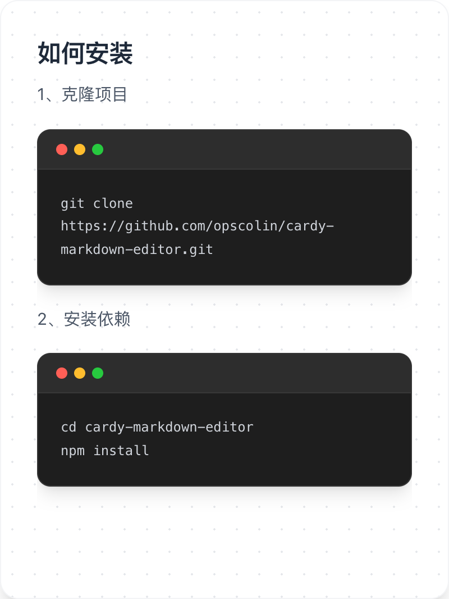
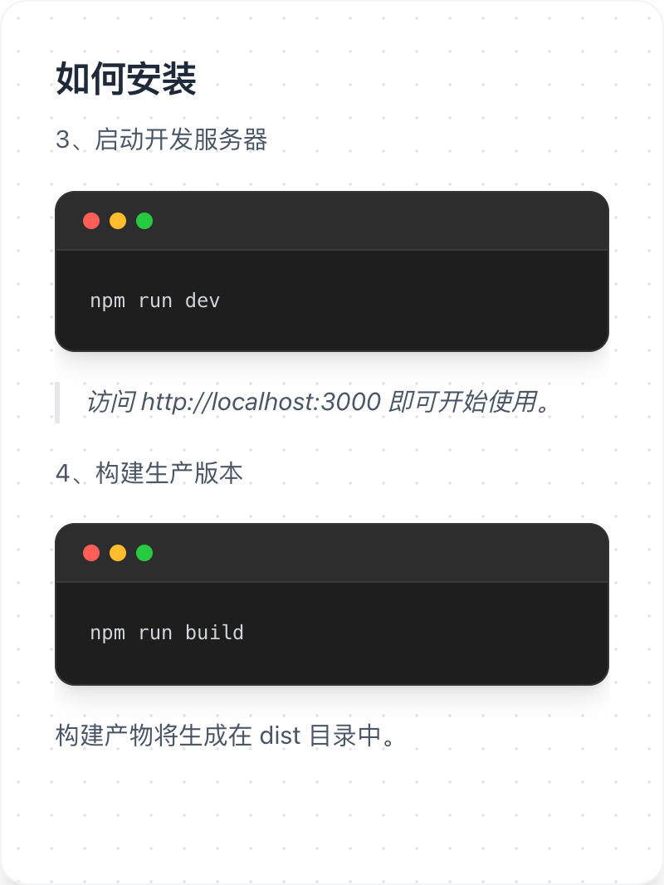

# Cardy Markdown Editor

Cardy 是一个专为精美笔记卡片设计的 Markdown 编辑器。它能够将你的 Markdown 内容实时转换为 3:4 比例的精致卡片，并支持导出为图片、PDF 或 ZIP 包，非常适合社交媒体分享、知识卡片制作和个人笔记存档。

 

  

## 🚀 核心功能

- **实时预览**：左侧编辑，右侧实时生成精美卡片。
- **多卡片支持**：使用 `---` 语法即可轻松分页，生成多张连续卡片。
- **富文本编辑**：
  - 支持标准的 Markdown 语法及 **GFM (GitHub Flavored Markdown)**。
  - **表格支持**：完美支持 Markdown 表格，并针对卡片展示进行了样式美化。
  - **图片支持**：支持从本地选择图片插入或直接粘贴图片，编辑器内实时显示图片缩略图。
  - **代码高亮**：内置 Mac 风格的代码块展示。
- **个性化定制**：
  - **等比缩放**：支持 XS/SM/BASE/LG 四档字号，标题与正文整体等比缩放。
  - **网格背景**：可一键开启/关闭卡片背景网格。
  - **自定义页脚**：支持为每份笔记设置专属页脚信息。
- **自动保存**：所有笔记和设置都会自动保存到浏览器的本地存储（LocalStorage），关闭页面或重启电脑后数据依然存在。
- **多样化导出**：
  - 单张卡片导出为 PNG 图片。
  - 全量导出为高质量 PDF。
  - 全量打包为 ZIP 压缩包。

## 🛠️ 技术栈

- **框架**: React 19 + Vite
- **样式**: Tailwind CSS 4
- **图标**: Lucide React
- **Markdown 解析**: React Markdown
- **导出工具**: html-to-image, jsPDF, JSZip
- **动画**: Motion

## 📦 安装与部署

### 1. 克隆项目

```bash
git clone https://github.com/opscolin/cardy-markdown-editor.git
cd cardy-markdown-editor
```

### 2. 安装依赖

```bash
npm install
```

### 3. 启动开发服务器

```bash
npm run dev
```

访问 `http://localhost:3000` 即可开始使用。

### 4. 构建生产版本

```bash
npm run build
```

构建产物将生成在 `dist` 目录中。

## 🤝 贡献

欢迎提交 Issue 或 Pull Request 来帮助改进 Cardy！

## 📄 开源协议

MIT License
